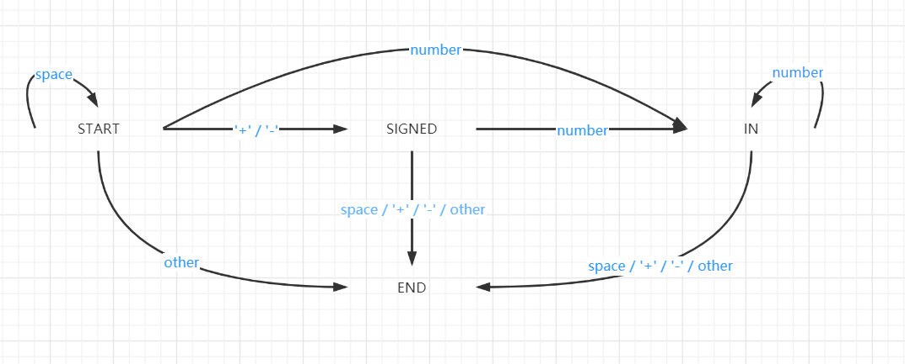

# 8. 字符串转换整数(atoi)

## 一、题目描述

题目链接：[8. 字符串转换整数 (atoi)](https://leetcode-cn.com/problems/string-to-integer-atoi/)

> 请你来实现一个`atoi` 函数，使其能将字符串转换成整数。

> 首先，该函数会根据需要丢弃无用的开头空格字符，直到寻找到第一个非空格的字符为止。

> 当我们寻找到的第一个非空字符为正或者负号时，则将该符号与之后面尽可能多的连续数字组合起来，作为该整数的正负号；假如第一个非空字符是数字，则直接将其与之后连续的数字字符组合起来，形成整数。

> 该字符串除了有效的整数部分之后也可能会存在多余的字符，这些字符可以被忽略，它们对于函数不应该造成影响。

> **注意**：假如该字符串中的第一个非空格字符不是一个有效整数字符、字符串为空或字符串仅包含空白字符时，则你的函数不需要进行转换。

> 在任何情况下，若函数不能进行有效的转换时，请返回 0。

**说明**：假设我们的环境只能存储 32 位大小的有符号整数，那么其数值范围为 [−2^31,  2^31 − 1]。如果数值超过这个范围，请返回  INT_MAX (2^31 − 1) 或 INT_MIN (−2^31) 。

## 二、示例

### 1. 示例1

> **输入**："42"

> **输出**：42

### 2. 示例2

> **输入**："   -42"

> **输出**：-42

> **解释**：第一个非空白字符是'-'，它是一个负号，我们尽可能将负号与后面所有连续出现的数字组合起来，最后得到 -42

### 3. 示例3

> **输入**: "4193 with words"

> **输出**: 4193

> **解释**: 转换截止于数字 '3' ，因为它的下一个字符不为数字。

### 4. 示例4

> **输入**: "words and 987"

> **输出**: 0

> **解释**: 第一个非空字符是 'w', 但它不是数字或正、负号。因此无法执行有效的转换。

### 5. 示例5

> **输入**: "-91283472332"

> **输出**: -2147483648

> **解释**: 数字 "-91283472332" 超过 32 位有符号整数范围。 因此返回 INT_MIN (−2^31) 。

## 三、解题经过

### 1. 常规解法：字符串处理

本题考查的是把字符串转化为整数的问题，或者说要自己实现一个`atoi`函数，那么，如何把由数字组成的字符串正确地转换成整数呢？

下面以 "123" 为例，说明这一转换过程。

(1) 当扫描到字符串的第一个字符 '1' 时，因为这是第一位，所以得到整数 1 .

(2) 当扫描到第二个字符 '2' 时，因为之前已有一个1(相当于10)，所以得到的整数为 `1*10+2 = 12`.

(3) 继续扫描到第三个字符 '3' 时，因为 '3' 的前面已经有了 12 (相当于120)，所以得到的数为 `12*10+3 = 123`.

因此，此题的基本**思路**是：从左到右扫描字符串中的每个字符，把之前扫描得到的数字乘以10，再加上当前字符表示的数字.

思路有了，代码可以编写如下：

```c++
class Solution {
public:
    int myAtoi(string str) {
        int n = 0;
        int i = 0;
        while(str[i] != '\0')
        {
            int c = str[i] - '0';
            n = n * 10 + c;
            ++i;
        }
        
        return n;
    }
};
```

但是，上述代码忽略了以下几个细节：

- 最好判断一下输入是否为空；

- 如果字符串的第一个字符是'-'号，最终得到的整数必为负整数；

- 输入的字符串中不能含有不是数字的字符；

- 输入的字符串不能太长，否则转换成整数后可能会导致整数溢出

上述问题中的前三个问题都比较好处理。但最后一个溢出问题比较麻烦，所以重点看一下这个问题.

一般来说，当发生溢出时，取最大或最小的int型值，即大于正整数能表示的范围时返回MAX_INT(2^31-1, 2147483647)，小于负整数能表示的范围时返回MIN_INT(-2^31, -2147483648)

编写代码之前，先来设置一些变量。

- sign用来处理数的正负，当sign>0时为正，当sign<0时为负

- n存放最终转换后的结果

- c表示当前数字

而后，你可能会编写如下代码来处理溢出问题：

```c++
// 当发生正溢出时，返回 INTMAX_MAX
if ((sign == '+') && (c > INTMAX_MAX - n * 10))
{
    n = INTMAX_MAX;
    break;
}
// 当发生负溢出时，返回 INTMAX_MIN
else if( (sign == '-') && (c-1 > INTMAX_MAX - n * 10))
{
    n = INTMAX_MAX;
    break;
}
```

### 2. 使用有限状态机

我们的程序在每个时刻有一个状态 `s`，每次从序列中输入一个字符 `c`，并根据字符 `c` 转移到下一个状态 `s'`。
这样，我们只需要建立一个覆盖所有情况的从 `s` 与 `c` 映射到 `s'` 的表格即可解决题目中的问题。

本题我们可以建立如下图所示的有限状态机：



我们也可以用下面的表格来表示这个状态机：
|  |' '| '+' / '-'| number | other |
| -- | -- | -- | -- | -- |
| START | START | SIGNED | IN | END |
| SIGNED | END | END| IN | END |
| IN | END | END | IN | END |
| END | END | END | END | END |

对应，我们可以写出如下代码：

```c++
enum State {
    START, SIGNED, IN, END
};

/**
 * FSM(Finite State Machine, 有限状态机)
 */
class FSM {
private:
    State state = START;
    std::unordered_map<State, std::vector<State>> table = {
            {START,  {START, SIGNED, IN,  END}},
            {SIGNED, {END,   END,    IN,  END}},
            {IN,     {END,   END,    IN,  END}},
            {END,    {END,   END,    END, END}}
    };

    static int transition(char ch) {
        if (isspace(ch)) {
            return 0;
        } else if (ch == '+' || ch == '-') {
            return 1;
        } else if (isdigit(ch)) {
            return 2;
        } else {
            return 3;
        }
    }

    int sign = 1;
    long long result = 0;

public:
    void deal(char ch) {
        state = table[state][transition(ch)];
        if (state == IN) {
            result = result * 10 + ch - '0';
            if (sign == 1) {
                result = std::min(result, (long long) INT_MAX);
            } else {
                result = std::min(result, -(long long) INT_MIN);
            }
        } else if (state == SIGNED) {
            sign = (ch == '+') ? 1 : -1;
        }
    }

    int getResult() {
        return sign * result;
    }
};


class Solution {
public:
    int myAtoi(std::string s) {
        if (s.empty()) {
            return 0;
        }
        FSM fsm = FSM();
        for (auto ch : s) {
            fsm.deal(ch);
        }
        return fsm.getResult();
    }
};
```
